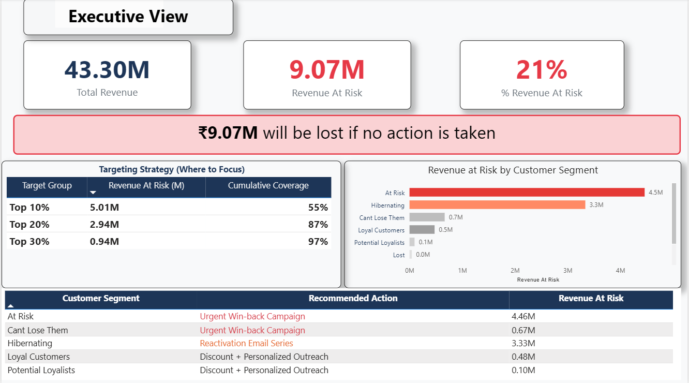

# Customer Churn Revenue Recovery System

## 🚀 Overview

An end-to-end data analytics system designed to identify high-risk customers, quantify revenue loss due to churn, and prioritize retention strategies for maximum business impact.

---

## 🎯 Problem Statement

Businesses lose significant revenue due to customer churn but lack visibility into:

* Which customers are most likely to churn
* How much revenue is at risk
* Where to focus retention efforts

---

## 💡 Solution

Built a data-driven system that:

* Predicts customer churn probability
* Calculates **Revenue at Risk**
* Identifies high-impact customer segments
* Recommends targeted retention actions

---

## 📊 Key Results

* **Total Revenue:** 43.30M
* **Revenue at Risk:** 9.07M
* **21% of total revenue is at risk**

### 🔥 Critical Insight

* Top **10% customers → 55%** of total risk
* Top **20% customers → 87%** of total risk

👉 A small segment drives the majority of revenue loss.

---

## 🧠 Approach

### 1. Data Processing

* Cleaned transactional data
* Structured customer-level dataset

### 2. Feature Engineering

* Recency, Frequency, Monetary (RFM)
* Behavioral and transactional features

### 3. Churn Prediction

* Model: **Logistic Regression**
* Output: Probability of churn

### 4. Revenue Risk Calculation

Revenue at Risk = Churn Probability × Customer Value

### 5. Decision System

* Ranked customers by revenue risk
* Segmented into priority groups
* Designed targeted actions

---

## 📈 Dashboard

The Power BI dashboard provides:

* Revenue at Risk overview
* Targeting strategy (Top 10%, 20%, 30%)
* Segment-wise risk breakdown
* Recommended actions

📌 *Dashboard preview:*


---

## 🛠 Tech Stack

* **Python** (Pandas, NumPy, Scikit-learn)
* **SQL**
* **Power BI**

---

## 📂 Project Structure

```bash
churn-revenue-recovery-system/
│
├── data/processed/        # Final datasets
├── notebooks/             # Data pipeline
├── sql/                   # SQL queries
├── dashboard/             # Power BI dashboard
├── report/                # Business report
├── README.md
```

---

## 📉 Limitations

* No time-based validation (possible data leakage)
* Static dataset (no real-time updates)
* Assumes fixed campaign success rate

---

## 🚀 Future Improvements

* Implement time-based model validation
* Deploy real-time scoring system
* Run A/B testing for retention strategies

---

## 📌 Key Takeaway

A small fraction of customers contributes to the majority of revenue risk, enabling highly efficient and targeted retention strategies.

---
